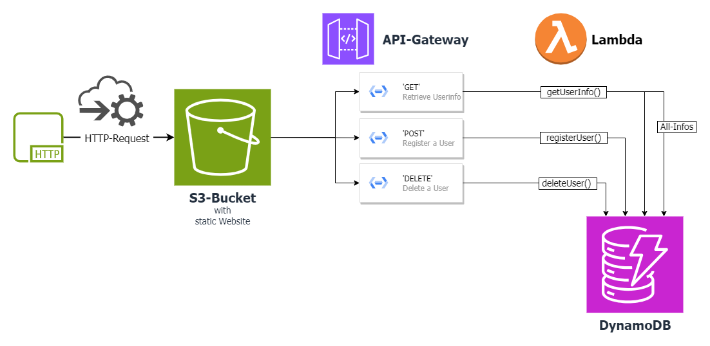

# Serverless Userdatabase

This simple static Website leverages 4 AWS Services:
- S3 for hosting the static website
- API Gateway that triggers Lambda functions
- Lambda that perform operations on a DynamoDB
- DynamoDB for storing the data

The Website is written in vanilla **HTML**, **CSS** and **JavaScript**. The Lambda functions are written in **Javascript/NodeJs**.

---

---

### Serverless Architecture

The architecture is completely **Serverless**. The static website is hosted on **S3**. The website is a simple form that allows the user to enter a name and an email address. The form is submitted to the **API Gateway**. The API Gateway triggers a **Lambda** function that stores, retrieves or deletes data in a **DynamoDB**. The **Lambda** function returns a response to the API Gateway. The API Gateway returns a response to the static website. The static website displays a message to the user and presents the received data.

---

### Deployment

The Website can currently be visted [here](http://simple-webpage-45678731243.s3-website.eu-central-1.amazonaws.com)

Thank you for checking this out!
Feel free to leave me some *feedback*.